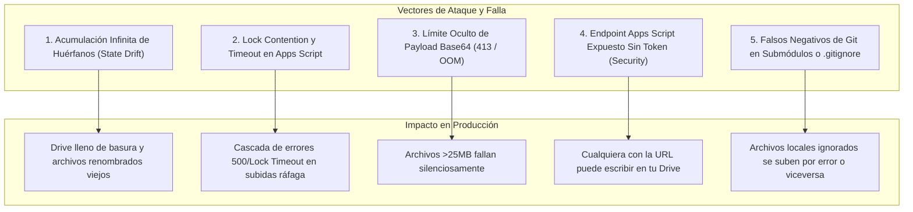

> **Created:** 2026-08-27
> **Last Updated:** 2026-08-31

# Adversarial Stress-Test: Respaldo en Google Drive vía Apps Script Bridge ☁️💣

## 🎯 Executive Summary & Premortem Mindset
Asumiendo que este sistema de respaldo **falla catastróficamente o entra en estado de corrupción silenciosa en 6 meses**, este análisis desglosa exactamente qué supuestos frágiles causarán esa caída, qué vulnerabilidades de concurrencia y cuota existen, y cómo blindar el sistema.

---

## 💥 Las 5 Vulnerabilidades Críticas y Modos de Falla

---

### 1. [Major] Acumulación Infinita de Archivos Huérfanos (State Drift Unidireccional)
* **El Supuesto Frágil:** *"Subir y sobrescribir es suficiente para mantener Drive al día"*.
* **Modo de Falla:** El sistema es 100% aditivo. Si renombras `task-old.md` a `task-new.md` o eliminas una carpeta obsoleta de `skills/`:
  - `task-new.md` se sube a Drive.
  - `task-old.md` **permanece en Drive para siempre**.
  - `sync_hashes.json` acumula miles de claves muertas con el tiempo.
  - En 6 meses, Drive contendrá decenas de archivos fantasma que confunden al usuario o a agentes que lean ese respaldo.
* **Mitigación Requerida:** 
  - Implementar una rutina periódica de reconciliación (Reconciliation Pass): comparar la lista de archivos existentes en la carpeta de Drive contra el árbol local y marcar los huérfanos para envío a papelera tras confirmación.

---

### 2. [Major] Lock Contention y Cascada de Timeouts con `LockService`
* **El Supuesto Frágil:** *"Agregar `LockService` en Apps Script soluciona la concurrencia mágicamente"*.
* **Modo de Falla:**
  - `LockService.getScriptLock()` es un bloqueo **global a nivel de script**.
  - Si la app de Windows dispara peticiones en paralelo o si el usuario corre dos instancias (o una tarea programada se solapa con una manual), las peticiones se encolan esperando el candado.
  - Como `waitLock` tiene un timeout de 25 segundos y cada subida tarda ~1.5 a 3 segundos en decodificar base64 y escribir en Drive:
    - Petición 1: 0s - 3s (Lock adquirido)
    - Petición 2: 3s - 6s (esperó en cola)
    - ...
    - Petición 10: intentará adquirir el lock a los 27s $\rightarrow$ **Falla por Lock Timeout**.
  - Esto produce una cascada de errores 500 si la subida cliente no es estrictamente secuencial y throttled.
* **Mitigación Requerida:**
  - Garantizar en C# que el cliente HTTP use un `SemaphoreSlim(1, 1)` para que **jamás** se ejecute más de una subida simultánea hacia el mismo Web App.
  - Mantener el delay inter-petición en >= 300 ms.

---

### 3. [Critical] Límite Oculto de Payload HTTP en Apps Script (20–30 MB vs 50 MB)
* **El Supuesto Frágil:** *"`MaxFileSizeMb = 50` es seguro porque está dentro del rango normal"*.
* **Modo de Falla:**
  - Google Apps Script tiene un límite no documentado pero estricto de ~25–30 MB en el tamaño del payload HTTP POST.
  - Al codificar un archivo binario de 40 MB en Base64, su tamaño se expande un 33% ($\approx 53.3 \text{ MB}$).
  - Google Cloud Edge rechazará la petición con `413 Payload Too Large` antes de que llegue a `doPost`, o el motor V8 de Apps Script lanzará `OutOfMemoryError: Execution exceeded memory limit`.
* **Mitigación Requerida:**
  - Reducir el límite por defecto de `MaxFileSizeMb` a **20 MB** en la configuración de la app.
  - Para archivos mayores a 20 MB, advertir al usuario en los logs y omitir la subida en lugar de estrellar la conexión.

---

### 4. [Major] Seguridad: Endpoint Expuesto sin Token de Autorización
* **El Supuesto Frágil:** *"Nadie conoce la URL larga de Apps Script (`/exec`)"*.
* **Modo de Falla (Security through Obscurity):**
  - El Web App está desplegado con `Execute as: Me` y `Who has access: Anyone`.
  - Si la URL se filtra en logs, tráfico de red no seguro o capturas de pantalla, cualquier actor malicioso puede enviar peticiones HTTP POST y saturar la cuenta de Google Drive con archivos basura o malware sin credenciales.
* **Mitigación Requerida:**
  - Agregar un `AuthToken` secreto configurable (Shared Secret Token).
  - La app envía `authToken` en el payload/header.
  - `Code.gs` valida `if (e.parameter.token !== "MI_TOKEN_SECRETO") throw "Unauthorized";`.

---

### 5. [Minor] Falsos Negativos y Falsos Positivos de Git
* **El Supuesto Frágil:** *"`git ls-files --error-unmatch` siempre da la verdad absoluta sobre si un archivo debe respaldarse"*.
* **Casos Borde no cubiertos:**
  - **Archivos en `.gitignore`:** Si un archivo de notas dentro de un repositorio de trabajo está en `.gitignore`, `git ls-files` falla con código 1. La app asumiría que es "huérfano" si se usara comprobación de Git. La arquitectura actual desacopla la sincronización a carpetas explícitas para evitar este problema.
  - **Repositorios desconectados o sin commit inicial:** Un repo recién hecho (`git init`) sin commits provocará que `git ls-files` falle, subiéndolo todo a Drive.
  - **Fallo de proceso `git.exe`:** Si `git` se congela o no está en PATH en un entorno alternativo, el fallback asume `false` y sube todo indiscriminadamente.

---

## 🛡️ Tabla de Mitigaciones y Prioridades

| Vulnerabilidad | Severidad | Mitigación Inmediata |
|---|---|---|
| **Límite Payload Base64** | 🔴 Crítico | Ajustar `MaxFileSizeMb` máximo a 20 MB. |
| **Lock Contention en Apps Script** | 🟠 Mayor | `SemaphoreSlim(1,1)` en C# + Throttling 350ms. |
| **State Drift (Huérfanos en Drive)** | 🟠 Mayor | Crear comando de reconciliación / escaneo de huérfanos. |
| **Endpoint Apps Script Abierto** | 🟠 Mayor | Implementar Token Secreto compartido (`authToken`). |
| **Edge cases de Git** | 🟡 Menor | Manejo explícito de archivos ignorados (`git check-ignore`). |

> **Implementation Status (2026-08-31):** The incremental scanning fast-path is now live. `sync_hashes.json` stores `{ Hash, LastWriteTimeUtcTicks, FileSize }` via `HashCacheEntry`. Files ≥ 1 KB with matching metadata bypass SHA-256 entirely via the `IsMetadataConfirmed` helper. The old `Dictionary<string, string>` format is auto-migrated on first load. The `LockService` invariant (`SemaphoreSlim(1,1)` + 300 ms inter-upload throttle) is preserved.
