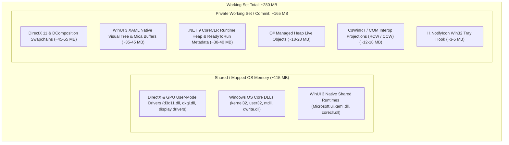
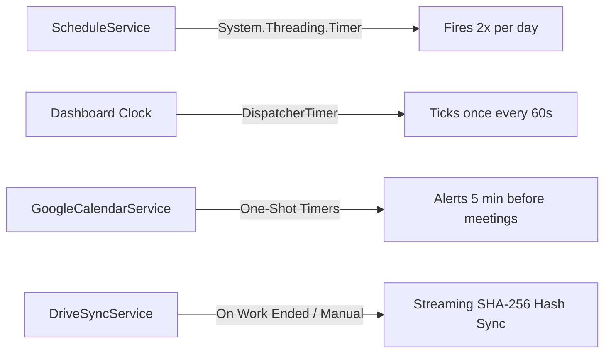

# Resource Consumption & Performance Profiling Guide

## Overview & Architecture Context

**Work Activity Panel** is built with **WinUI 3 (Windows App SDK 2.4.0)**, **.NET 9**, and **H.NotifyIcon**. It runs as an unpackaged desktop application designed to stay resident in the Windows 11 System Tray while orchestrating work schedules, meetings, cloud backups, and workspace tools.

This document details the live performance profile, anatomical memory distribution, background execution behavior, and architectural decisions governing resource utilization.

---

## 1. Live Telemetry & Baseline Metrics

The following metrics represent real-world telemetry captured from the running application process on Windows 11 under typical idle conditions:

| Metric | Measured Baseline | Framework Baseline | Health Status |
| :--- | :--- | :--- | :--- |
| **CPU Usage (Idle)** | **0.0%** | 0.0% – 0.1% | 🏆 **Optimal (Zero wakeups)** |
| **Private Commit Memory** | **~160 – 168 MB** | 140 – 200 MB | 🟢 **Healthy (Process-exclusive)** |
| **Working Set (RAM)** | **~274 – 287 MB** | 240 – 320 MB | 🟢 **Normal (Includes OS/GPU shared pages)** |
| **C# Managed Heap (Live Objects)** | **~18 – 28 MB** | 15 – 35 MB | 🟢 **Ultralight (ViewModels, Models, DI)** |
| **Active OS Threads** | **~16 threads** | 14 – 18 threads | 🟢 **All in Deep Wait states (0 CPU cycles)** |
| **Handle Count** | **~1460 handles** | 1200 – 1600 handles | 🟢 **Stable (No handle leaks)** |
| **Battery / Modern Standby Impact** | **Negligible** | Negligible | 🏆 **Allows processor deep C-States** |

---

## 2. Anatomical Memory Breakdown

A common question in Windows desktop development is how memory is distributed across a modern WinUI 3 process.

### Component Breakdown

1. **DirectX & OS Shared DLLs (~115 MB):** Read-only, shared memory pages mapped by Windows (`kernel32.dll`, `user32.dll`, `d3d11.dll`, `dxgi.dll`, `dwrite.dll`). These pages are shared across all running processes in the operating system and do not consume exclusive physical RAM.
2. **DirectX 11 & DirectComposition Swapchains (~50 MB):** Hardware-accelerated buffers that power Fluent Design, the Mica background backdrop, and smooth window animations.
3. **WinUI 3 Native XAML Engine (~40 MB):** The native C++ visual tree (`Microsoft.ui.xaml.dll`), theme resource dictionaries, and DirectWrite font rasterization.
4. **CoreCLR .NET 9 Runtime (~35 MB):** JIT/ReadyToRun compiled code, method tables, type definitions, and garbage collection structures.
5. **C# Managed Heap (~23 MB):** The actual application data footprint, including the Dependency Injection container, ViewModels, observable collections, cached models, and iCal calendar data.
6. **CsWinRT Interop Layer (~15 MB):** Projections bridging managed C# code with unmanaged Windows App SDK COM interfaces.

> [!NOTE]
> **Working Set vs. Private Commit:**
> - **Commit Charge (~160 MB):** The actual private virtual memory allocated by the application that cannot be shared with other processes.
> - **Working Set (~280 MB):** The physical RAM pages currently mapped into the process, which includes shared OS libraries. If RAM pressure occurs, Windows automatically manages and pages out inactive portions of the working set.

---

## 3. Technology Stack Comparison

| Technology Stack | Reference Applications | Private Memory | Working Set (RAM) | Idle CPU Usage | Battery & Power Efficiency |
| :--- | :--- | :--- | :--- | :--- | :--- |
| **WinUI 3 + .NET 9** *(WorkActivityPanel)* | *WorkActivityPanel* | **~160 MB** | **~280 MB** | **0.0%** | **Optimal:** Zero background render loops; allows processor C-States. |
| **Electron / Chromium** | Slack, Granola, Discord, Teams | **~400 – 900 MB** | **~600 MB – 1.2 GB** | **1.0% – 3.5%** | **Heavy:** Continuous Chromium IPC and frame rendering, leading to measurable battery drain. |
| **WPF / .NET 9** | PowerToys utilities | **~130 – 190 MB** | **~220 – 310 MB** | **0.0% – 0.2%** | **Good:** Legacy DirectX 9 rendering pipeline. |
| **Pure C++ / Win32** | 7-Zip, Notepad (Classic) | **~20 – 50 MB** | **~40 – 90 MB** | **0.0%** | **Optimal:** Extremely lightweight, but lacks modern declarative UI and Mica integration. |

---

## 4. Background Services & CPU Profile

All background services in **WorkActivityPanel** are event-driven and strictly coalesced to prevent CPU wakeups:

- **Schedule Service (`ScheduleService.cs`):** Uses a `System.Threading.Timer` set to fire only at work start and work end times (deserializes schedule, schedules next transition, then enters sleep).
- **Dashboard Clock (`DashboardViewModel.cs`):** A single `DispatcherTimer` ticking once every **60 seconds** to refresh the `HH:mm` display string. Execution duration is `< 0.2 ms`.
- **Google Calendar Service (`GoogleCalendarService.cs`):** No continuous network polling. Fetches iCal feed on startup or manual refresh, then registers one-shot timers 5 minutes before scheduled meetings.
- **Drive Sync Service (`DriveSyncService.cs`):** File hashing uses streaming `SHA256.Create()` over `FileStream`, avoiding loading entire files into memory. Uploads only trigger at the end of the workday or on demand.
- **GitHub Auth Service (`GitHubAuthService.cs`):** Reads the local `hosts.yml` config file on demand with zero background polling.

---

## 5. Thread Topology

The process maintains ~16 active OS threads, categorized as follows:

| Thread Group | Count | Role / State |
| :--- | :--- | :--- |
| **UI Dispatcher Thread** | 1 | Main thread executing the WinUI 3 message loop (`GetMessage` / `MsgWaitForMultipleObjectsEx`). |
| **CoreCLR ThreadPool Workers** | 3 – 5 | Managed worker threads in deep wait state (`GetQueuedCompletionStatus`). |
| **CoreCLR I/O Completion Ports (IOCP)** | 2 – 4 | Asynchronous I/O listeners for network and file operations. |
| **Direct3D 11 / DComposition Render** | 2 – 3 | Background rendering thread managed by Windows App SDK runtime. |
| **H.NotifyIcon Tray Hook** | 1 | Native Win32 window message hook for tray icon interactions. |

> [!TIP]
> Sleeping threads consume only ~12 KB of committed stack memory each. 16 sleeping threads represent less than **0.2 MB of physical RAM** and **0% CPU utilization**.

---

## 6. Optimization Analysis & Antipatterns

### ❌ Detrimental Antipatterns (Avoided by Design)

#### 1. Forcing `EmptyWorkingSet()` / `SetProcessWorkingSetSize(-1, -1)`
- **The Pitfall:** Some legacy utilities call `EmptyWorkingSet` when minimizing to the system tray to display an artificially low memory footprint (~15 MB) in Task Manager.
- **The Consequence:** This forcibly evicts all physical memory pages to the Windows paging file (`pagefile.sys`). When the user restores the window from the tray, the application experiences hundreds of **Hard Page Faults**, introducing a **200–500 ms UI stutter** and causing unnecessary SSD write wear and battery consumption.
- **Decision:** **Strictly avoided.** We preserve smooth, sub-16ms instant window restoration.

#### 2. Forcing `GC.Collect()` on Tray Minimize
- **The Pitfall:** Triggering a full Generation 2 garbage collection on window hide.
- **The Consequence:** Reclaims at most 2–4 MB while prematurely promoting Gen 1 objects to Gen 2, fragmenting CLR memory heaps and triggering a Stop-The-World pause.
- **Decision:** **Strictly avoided.** .NET 9's automated workstation GC manages generation collection optimally based on actual system memory pressure.

---

### 🟢 Recommended & Future Architectural Optimizations

1. **`PublishReadyToRun` (Enabled):**
   Already configured in `WorkActivityPanel.csproj` (`<PublishReadyToRun>True</PublishReadyToRun>`). Precompiles MSIL into machine code to minimize JIT compiler overhead and cold-startup latency.
2. **Native AOT Evaluation (Future Roadmap):**
   .NET 9 and Windows App SDK 2.4 introduce experimental Native AOT support (`CsWinRTAotOptimizerEnabled`). Once ecosystem dependencies (such as tray icon hooks and reflection-free serialization) achieve full compatibility, Native AOT may reduce private commit by an additional **~25–35 MB**.
3. **Asset Resolution Tuning:**
   Ensure UI icon assets are pre-scaled to standard DPIs (100%, 150%, 200%) to minimize runtime Direct2D image scaling buffers.
